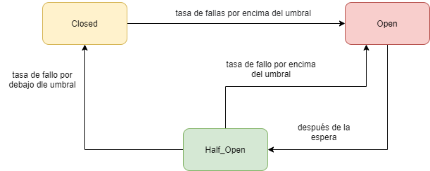

= CircuitBreaker and TimeLimiter with Resilience4j in Spring Boot =

== Introduction
This is a simple example about how to use resilience4j in our microservices' architecture.

In this example you can see two different examples:

    * CircuitBreaker: Set a circuit to avoid unnecessary request to other different services and avoid any blocking in a thread.

    * TimeLimiter: Throw and error when a slow request is processed.

If you want more information you can take a look into:

  * Spanish: https://refactorizando.com/ejemplo-circuit-breaker-resilience4j-spring-boot

  * English: https://refactorizando.com/en/circuit-breaker-with-resilience4j-in-spring-boot/

== How does it run?

This is a normal spring boot application, so to run it you can execute:

    mvn spring-boot:run

== How does it work?

If you want to check the example:

To verify the circuitBreaker make several request to: http://localhost:8080/api/timeDelay/10
To verify the timelimiter make one request to: http://localhost:8080/api/timeout/5

